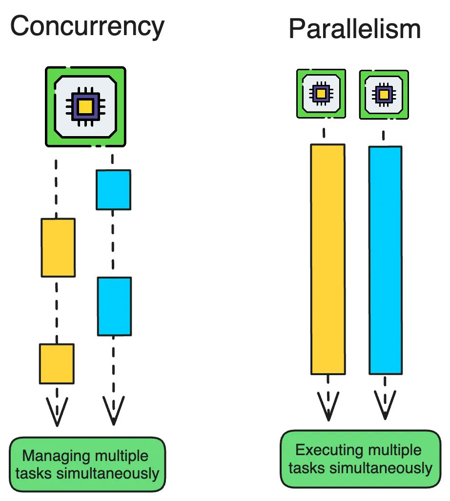

# Concurrency & Parallelism

**Concurrency** is about managing many tasks (dealing with them at once, by switching), creating the illusion of simultaneous progress, often on a single core. 

**Parallelism** is about executing many tasks literally at the same time, requiring multiple processing units (cores) for true simultaneous work, speeding up computation. 

---

## Contents

