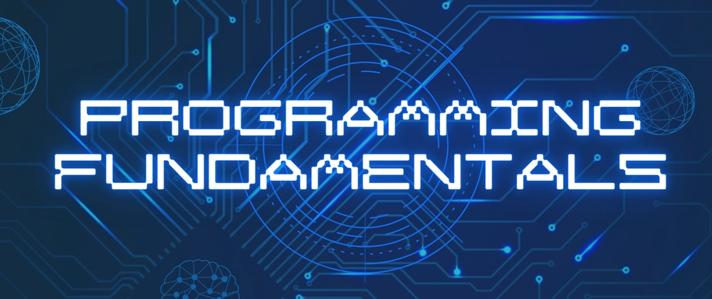

# Programming Fundamentals

**Programming fundamentals** are the core concepts and principles that form the foundation for writing code, including variables, data types, control structures, loops, functions, and algorithms.

---

## Contents