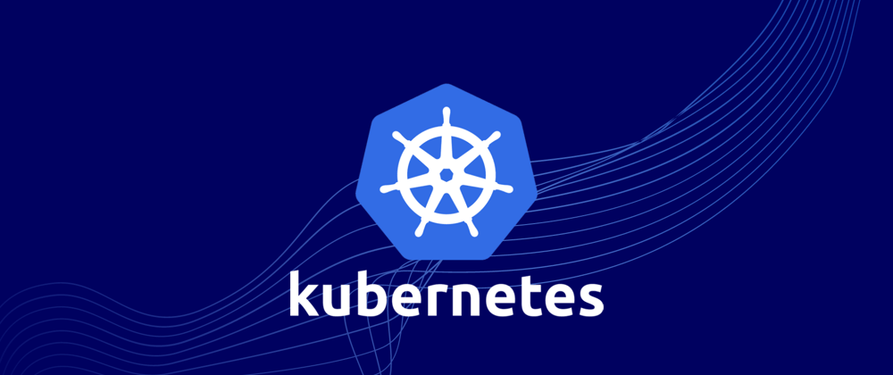

**Kubernetes** is an open source container orchestration platform that automates many of the manual processes involved in deploying, managing, and scaling containerized applications.

Kubernetes automates the configuration of your applications and maintains and tracks resource allocation. A project of the  **Cloud Native Computing Foundation (CNCF)**, Kubernetes was first introduced in 2014 and has become a widely adopted platform for organizations to run distributed applications and services at scale.

