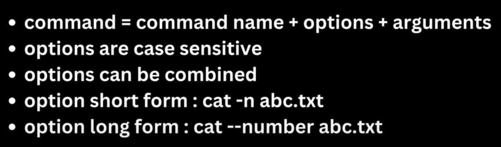

# Linux Commands

**Linux commands** are essential for controlling and managing the system through the terminal. These commands are used for tasks like file handling, process management, user administration, networking, and system monitoring.

---

## Contents